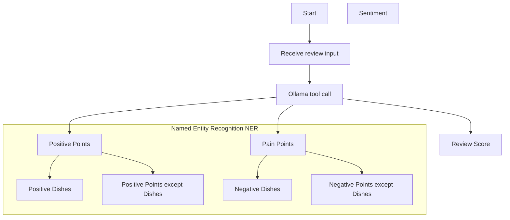

# Keyphrase Extraction / Aspect Extraction
Keyphrase Extraction / Aspect Extraction : Extracting phrases like “slow service” or “great food” from text.
Formal names:
- Aspect-Based Sentiment Analysis (ABSA): Assigning sentiment to specific aspects (e.g., “food”, “service”).
- Opinion Mining: Finding subjective expressions in text.
- Named Entity Recognition (NER) (if it's targeting named items like “ice cream” or “burger”)

