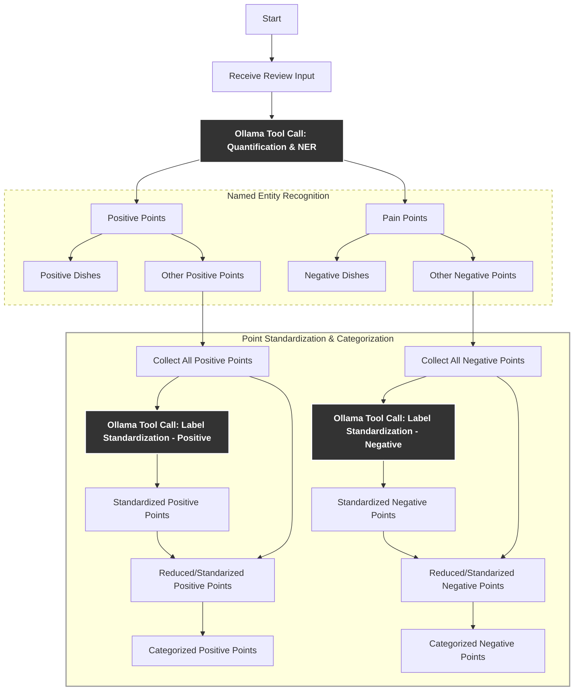
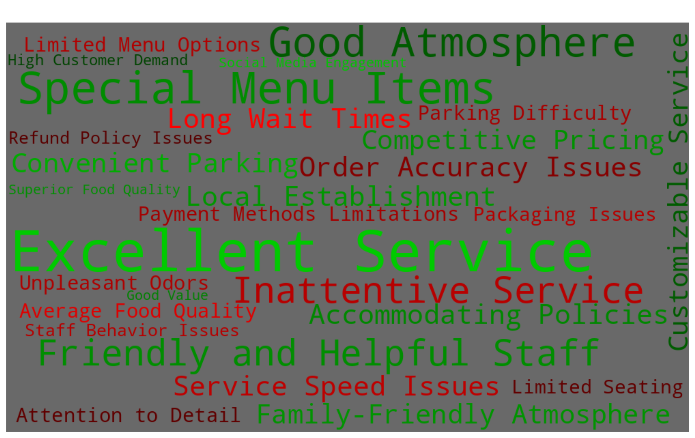

# 🧠 Text Quantization,NER,Standardization Pipeline

This repository implements a multi-step pipeline for understanding and structuring raw text (reviews, in this case). The goal is to move from **raw text** to **structured insights** through sentiment analysis, keyphrase extraction, and label standardization.
The entire workflow is carried out using Qwen3 LLM via Ollama, enabling tool call, ensuring structured output at the end.  
The workflow is implemented on Open Source _"yelp-restaurant-reviews"_ data, but can be extended to convert any raw text to ***quantified*** ***standardized*** ***structured*** output.  

---

## 📋 Pipeline Overview

The processing pipeline operates in **three main stages**:

### 1️⃣ [Basic Sentiment Analysis](./Basic_Sentiment_Analysis/sentiment_quantification.ipynb)
**Goal**: Rate the entire review on a scale from 0 (very negative) to 5 (very positive).

#### Theoretical Context:
- **Sentiment Analysis**: Assigning an overall polarity score to a review.
- Common techniques include zero-shot classification, review embedding, or trained sentiment classifiers.

---

### 2️⃣ [Quantitative Named Entity Recognition (NER)](./Quantitative_Named_Entity_Recognition/Named_Entity_Recogntion_Sentiment.ipynb)
**Goal**: Extract opinionated phrases like _"slow service"_ or _"great food"_, and identify references to specific entities (e.g., _"ice cream"_, _"burger"_).

#### Theoretical Context:
- **Keyphrase Extraction / Aspect Extraction**: Pulling out meaningful aspects from text.
- **Aspect-Based Sentiment Analysis (ABSA)**: Attaching sentiment to specific targets like _"food"_, _"service"_.
- **Opinion Mining**: Identifying subjective expressions.
- **Named Entity Recognition (NER)**: Capturing references to named items (e.g., dishes, products).

---

### 3️⃣ [Standardization / Canonicalization](./Standardization_Canonicalization/Standardization_of_Quantified_Results.ipynb)
**Goal**: Map diverse phrasings (e.g., _"the service was slow"_ vs _"slow service"_) to a single standardized label.

#### Theoretical Context:
- **Text Normalization / Canonicalization**: Reducing linguistic variance across extracted phrases.
- **Synonym Resolution / Clustering**: Grouping semantically similar expressions under unified tags.


## 📋 Pipeline Flow



## Sample Output:
A **structured JSON** representation of the review, including:
```json
{
  "rating": 4,
  "positive_points": ["delicious food", "friendly staff"],
  "pain_points": ["slow service"],
  "categories": {
    "food": ["delicious food"],
    "service": ["slow service"]
  }
}
```
