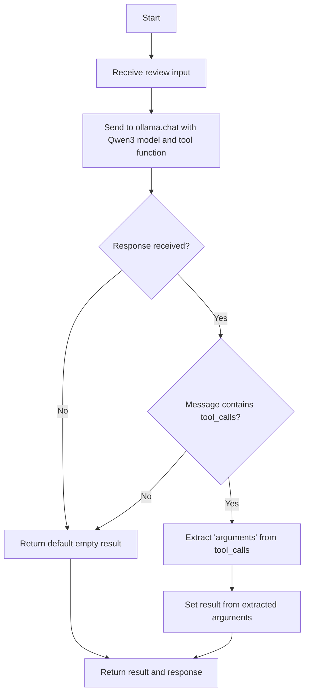

# Canonicalization-via-Ollama-LLMs
Using Ollama llm to reduce diverse phrasings like “slow service” and “the service was slow”, to a single standardized label.

```mermaid
flowchart TD
    A[Start] --> B[Receive review input]
    B --> C[Send to ollama.chat with Qwen3 model and tool function]
    C --> D{Response received?}
    D -- No --> E[Return default empty result]
    D -- Yes --> F{Message contains tool_calls?}
    F -- Yes --> G[Extract 'arguments' from tool_calls]
    F -- No --> E
    G --> H[Set result from extracted arguments]
    E --> I[Return result and response]
    H --> I
```
