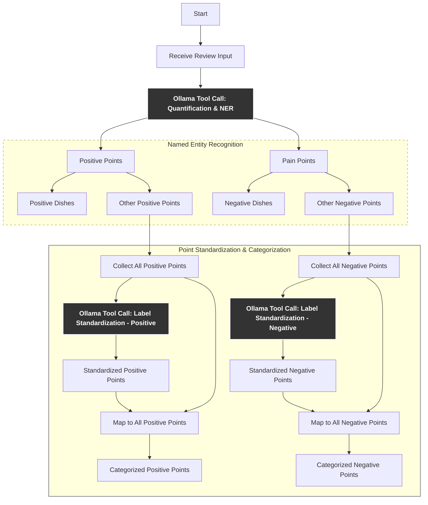

# Standardization / Canonicalization
Mapping diverse phrasings like “slow service” and “the service was slow” to a single standardized label.
Formal names:
- Text Normalization
- Canonicalization
- Synonym Resolution / Clustering

