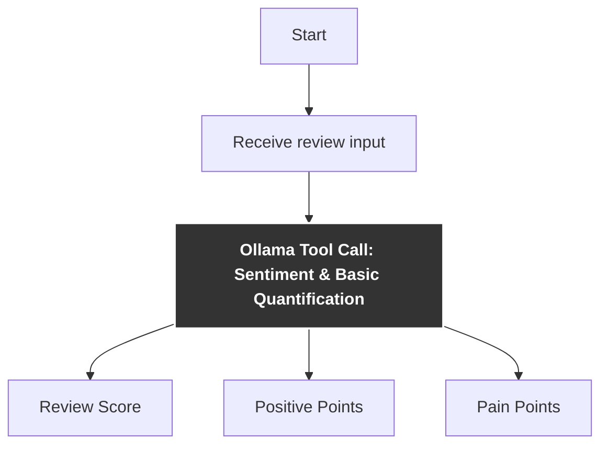

# Sentiment & Basic Quantification
This function uses Ollama's Qwen3 language model to analyze a restaurant review and extract structured sentiment insights. It outputs a JSON containing:

- rating (integer, 0–5): The overall sentiment score.

- pain_points (list): Key negative aspects mentioned (if any).

- positive_points (list): Key positive aspects mentioned (if any).

